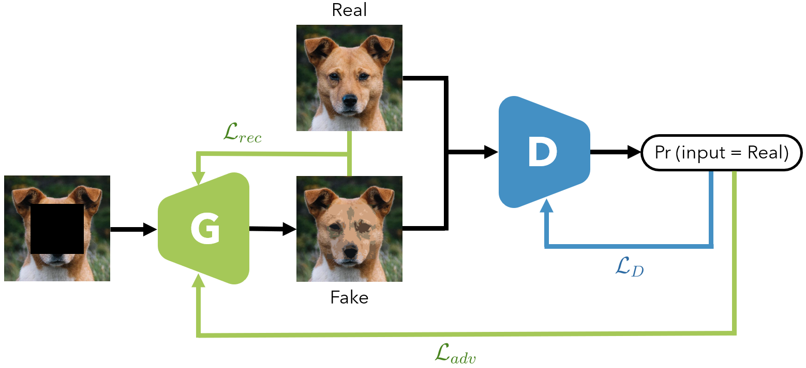
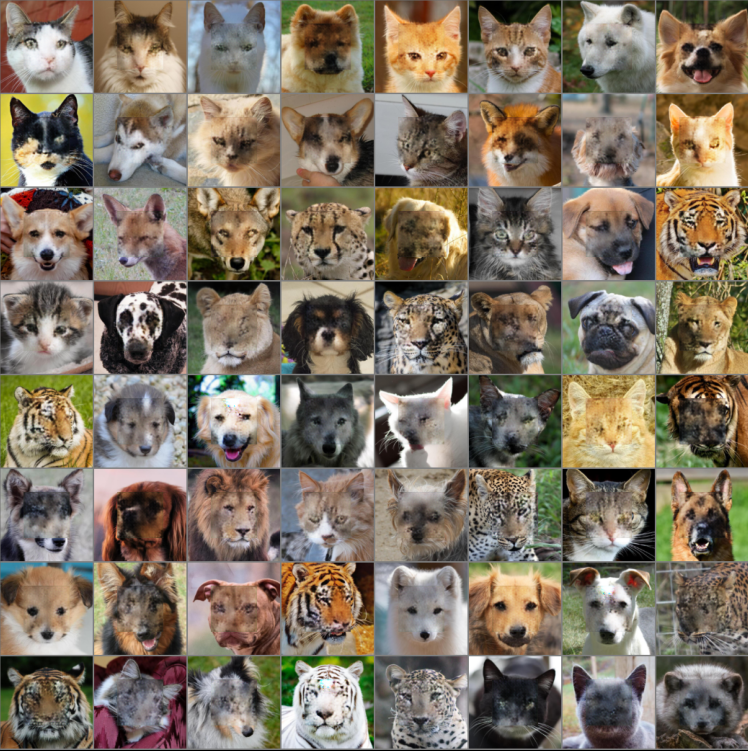
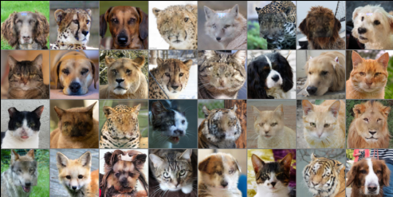

### Authors
Robin Byl,
Florence Franchomme,
Nedid Ismaili,
Adeline Wantiez

# Image Inpainting
This project aims at inpainting missing region(s) of an image based on the remaining pixels using deep learning-based methods. 
For this, a Generative Adversarial Network (GAN) has been implemented. Its purpose is to generate visually plausible image to fill the missing content. 
The considered dataset is the Animal Faces-HQ (AFHQ).

## Description

## Results
Results when feeding the whole image to the discriminator:

Results when feeding the patch to the discriminator:

## Files
    -dataset
        -afhq
            -cat
            -dog
            -wild
    -Model
        Generator.py
        Discriminator.py
    -Results
        General_architecture.png
        ResultsExample.png
    Preprocessing.py
    read_data.py
    README.md
    Training.py
    TrainigFunctions.py
    useTrainedModels.py

## Clone Project

git clone https://github.com/FFrancho99/Project_ML.git

## Packages

    numpy >= 1.23.5
    matplotlib >= 3.7.1
    torch >= 2.0.0
    torchmetrics >= 0.11.4
    torchvision >= 0.15.1
    uuid >= 1.30

## Usage
Run Training.py file to create, train, validate and test the model

## Sources
Dataset: Animal Faces-HQ (AFHQ) from https://www.kaggle.com/datasets/andrewmvd/animal-faces
    
