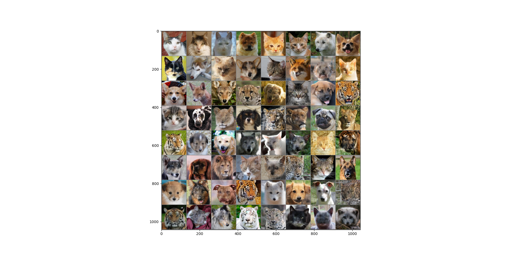

### Authors
Robin Byl,
Florence Franchomme,
Nedid Ismaili,
Adeline Wantiez

# Image Inpainting
This project aims at inpainting missing region(s) of an image based on the remaining pixels using deep learning-based methods. 
For this, a Generative Adversarial Network (GAN) has been implemented. 
Its purpose is to generate visually plausible image to fill the missing content.

## Description

## Results

## Files
    main.py
    useTrainedModels.py
    preprocessing.py
    Training.py
    TrainigFunctions.py
    read_data.py
    -Model
        Generator.py
        Discriminator.py
    -dataset
        -afhq
            -cat
            -dog
            -wild

## Installation

git clone https://github.com/FFrancho99/Project_ML.git
Packages to install:
    

## Usage

To run pretrained model:

## Sources
Dataset: Animal Faces-HQ (AFHQ) from https://www.kaggle.com/datasets/andrewmvd/animal-faces
    
